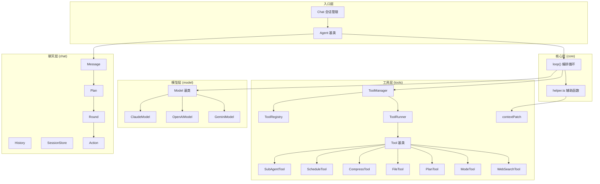

# Agent 架构深度分析

## 1. 整体拓扑



## 2. 五大模块职责

| 模块 | 核心文件 | 职责 | 行数(≈) |
|------|----------|------|---------|
| **入口** | [Agent.ts](file:///D:/_my/code-records/website/plugins/docusaurus-plugin-doc-agent/src/agent/Agent.ts) | 抽象基类：绑定 instructions + tools + subAgents，驱动 loop | 141 |
| **core** | [loop.ts](file:///D:/_my/code-records/website/plugins/docusaurus-plugin-doc-agent/src/agent/core/loop.ts), [helper.ts](file:///D:/_my/code-records/website/plugins/docusaurus-plugin-doc-agent/src/agent/core/helper.ts) | 核心编排循环：model ↔ tools ↔ sub-agents 交互协议 | 254 |
| **model** | [Model.ts](file:///D:/_my/code-records/website/plugins/docusaurus-plugin-doc-agent/src/agent/model/Model.ts) + 3 个 Provider | 统一 LLM 协议差异，stream-first 设计 | ~900 |
| **tools** | [Tool.ts](file:///D:/_my/code-records/website/plugins/docusaurus-plugin-doc-agent/src/agent/tools/tool/Tool.ts) + Manager/Registry/Runner + 7 个具体工具 | 工具抽象、注册、执行、超时、调度 | ~1200 |
| **chat** | [Message.ts](file:///D:/_my/code-records/website/plugins/docusaurus-plugin-doc-agent/src/agent/chat/Message.ts), [Chat.ts](file:///D:/_my/code-records/website/plugins/docusaurus-plugin-doc-agent/src/agent/chat/Chat.ts), Plan/Round/Action, [SessionStore.ts](file:///D:/_my/code-records/website/plugins/docusaurus-plugin-doc-agent/src/agent/chat/SessionStore.ts) | 消息建模、UI 状态追踪、会话持久化 | ~760 |

---

## 3. 优点分析

### ✅ 3.1 Stream-First + AsyncGenerator 贯穿全栈

整个事件流管线使用 `AsyncGenerator<AgentEvent>` 从 `Model.stream()` → `loop()` → `Agent.run()` → `Chat.stream()` 一路贯穿。

```
Model.stream() → yield ModelEvent
      ↓
loop()         → yield AgentEvent (包装 ModelEvent + ToolEvent)
      ↓
Agent.run()    → yield AgentEvent (追加 agent_start/done/error)
      ↓
Chat.stream()  → yield AgentEvent (驱动 UI)
```

**好处**：
- 无需额外消息总线或 EventEmitter，`for await...of` 即是消费协议
- 天然支持背压（backpressure）——consumer 不拉，producer 不推
- 每一层只做自己的包装/增强，流式事件自然穿透，UI 实时更新零延迟

> [!TIP]
> 这比常见的 callback/EventEmitter 模式干净得多，TypeScript 类型也能在每一层精确收窄。

### ✅ 3.2 Model 抽象的 Template Method 模式

[Model.ts](file:///D:/_my/code-records/website/plugins/docusaurus-plugin-doc-agent/src/agent/model/Model.ts) 使用经典 Template Method：

- 基类定义 `stream()` (abstract) + `complete()` (final)
- 子类只需实现 `stream()` + `request()` + `requestStream()` + `expandMessageToProviderMessages()` + `expandToolAskToProviderMessages()`
- `complete()` 由基类消费 `stream()` 聚合，**避免每个 provider 维护两套解析逻辑**

```typescript
// 基类
async complete(request: ModelRequest): Promise<ModelResponse> {
    for await (const event of this.stream(request)) { ... }
}

// 子类只关心 stream
abstract stream(request: ModelRequest): AsyncGenerator<ModelEvent>;
```

**好处**：新增 Provider 只需一个文件（≈300-500 行），无需修改 core 层任何代码。

### ✅ 3.3 工具的"自主回问"（AskModel）机制

这是本架构最有特色的设计创新。工具不再是被动的纯函数，而是通过 `this.askModel()` 具备向 model 发起子询问的能力：

```typescript
// CompressTool 示例
const answer = await this.askModel({
    input: { contextPreview, keepTail, tokenEstimate },
    prompt: this.summaryPrompt,
});
```

**子询问的完整链路**：
1. `loop()` 创建 `createAskFactory()` 闭包
2. `ToolRunner` 执行前调用 `tool.setAsk(createAsk(toolName))`
3. 工具执行中通过 `this.askModel()` 发起独立的 `model.complete()` 调用
4. 子询问使用 `toolChoice: 'none'` **禁止递归调用工具**

**好处**：工具遇到歧义/边界情况时可以"自主决策"而非硬编码 fallback，极大提升了 agent 的鲁棒性。

### ✅ 3.4 ContextPatch 机制

工具不直接操作上下文，而是返回 [ContextPatch](file:///D:/_my/code-records/website/plugins/docusaurus-plugin-doc-agent/src/agent/tools/tool/Tool.ts#L22-L25) 描述修改意图，由 loop 统一应用：

```typescript
type ContextPatch =
    | { type: 'append'; context: Message[] }
    | { type: 'replace'; context: Message[] }
    | { type: 'compact'; context: Message[]; summary?: string };
```

**好处**：
- 工具只能拿到 `readonly Message[]`，不能直接 mutate
- loop 是唯一的上下文写入者，单一职责明确
- 上下文变更可追踪（`context_patch` 事件）

### ✅ 3.5 ScheduleTool 把调度"建模为工具"

[ScheduleTool](file:///D:/_my/code-records/website/plugins/docusaurus-plugin-doc-agent/src/agent/tools/ScheduleTool.ts) 不是 loop 里的特殊分支，而是一个普通 Tool——model 通过调用 `schedule_tools` 来表达"并行/串行批量执行"的意图。

**好处**：
- loop 代码不膨胀——loop 始终只认 `tool_call → ToolManager.runCall()`
- 调度策略可扩展（模型自适应选择 serial/parallel）
- 保持了 loop 的单一职责

### ✅ 3.6 SubAgent 同样建模为工具

[SubAgentTool](file:///D:/_my/code-records/website/plugins/docusaurus-plugin-doc-agent/src/agent/tools/SubAgentTool.ts) 让 agent 组合也变成了标准的工具调用路径，而非 loop 里的硬编码分支。ToolManager 在有 subAgents 时自动注入 `SubAgentTool`。

### ✅ 3.7 Plan → Round → Action 三层 UI 状态模型

```
Message
  └─ Plan (一次完整的 agent 运行)
       ├─ Round (一轮 model 调用 + 工具执行)
       │    ├─ Action (thinking)
       │    ├─ Action (tool: web_search)
       │    └─ Action (content)
       └─ Round
            └─ ...
```

`Plan.apply(event)` 统一接收 AgentEvent，就地推进状态机，UI 只需渲染 Plan/Round/Action 树。

### ✅ 3.8 良好的防御性编程

- `loop()` 的 `maxRounds` 硬限 + 超时上限
- `ToolRunner.withTimeout()` 带 AbortController
- `SessionStore` 的 QuotaExceeded → prune → retry
- `SettledToolCall` 用 `symbol` token 做 race 消歧

---

## 4. 缺点分析

### ❌ 4.1 工具结果没有写回 `runMessages`

> [!CAUTION]
> **这是最关键的架构缺陷。**

看 [loop.ts L192](file:///D:/_my/code-records/website/plugins/docusaurus-plugin-doc-agent/src/agent/core/loop.ts#L192) 的注释说"工具结果通过 tool_done 事件写入当前 assistant round"，但 **loop 自身并没有把工具结果 push 到 `runMessages`**。模型下一轮调用看到的 `runMessages` 中只有 `Plan.apply(event)` 在 `Message` 对象上就地修改的副作用数据。

这意味着：
- 工具结果完全依赖 `Message.plan → Round → Action` 的就地修改来传递给下一轮 model
- 但 `Model.expandMessageToProviderMessages()` 必须能从 `Plan/Round/Action` 树中重建出完整的 provider 格式消息
- 如果某个 Model 实现没有正确遍历 `roundActions()`，工具结果就会丢失

**建议**：考虑在 loop 中显式构建 tool_result 消息，或至少在注释中明确说明"工具结果通过 Plan 就地修改传递"的契约。

### ❌ 4.2 `Context.ts` 是空文件

[Context.ts](file:///D:/_my/code-records/website/plugins/docusaurus-plugin-doc-agent/src/agent/core/Context.ts) 空文件却仍然存在于 core 目录中，增加认知噪音。如果规划中要用，至少应加注释说明意图；如果废弃了，应删除。

### ❌ 4.3 Model 适配器过于臃肿

[ClaudeModel.ts](file:///D:/_my/code-records/website/plugins/docusaurus-plugin-doc-agent/src/agent/model/ClaudeModel.ts) 有 **526 行**，`stream()` 方法单体超过 200 行，包含大量 SSE 解析、content_block 拼装、chat-completions 双路径逻辑。

**问题**：
- 同时支持 Claude 原生 Messages API 和 OpenAI 兼容 Chat Completions API 的代码混在一个类里
- `isChatCompletionsEndpoint()` 的 URL 嗅探是运行时判断，增加了心智负担
- 复制粘贴的 `roundActions()` 遍历逻辑在 Claude 和可能的其他 Model 中重复

**建议**：
- 将 chat-completions 适配拆成独立类（如 `ClaudeChatModel`），或将共享逻辑提到基类
- `roundActions()` 这样从 Plan 树提取 provider actions 的逻辑应上提到 `Model` 基类

### ❌ 4.4 `ToolManager` 每次 `runCall` 都创建新 `ToolRunner`

```typescript
// ToolManager.ts L62
async runCall(call: ModelToolCall, timeoutMs = this.defaultTimeoutMs): Promise<ToolResult> {
    const runner = new ToolRunner({ ... }); // 每次都 new
    const result = await runner.runCall(call, timeoutMs);
    ...
}
```

**问题**：
- 并发工具调用时，每个 call 有独立的 ToolRunner 实例，它们之间无法共享 `AbortController` 的 `killAll()` 语义
- `ScheduleTool` 拿到的 `context.runner` 是由 ToolRunner 自身的 `createScopedRunner()` 创建的，嵌套层级可能不受控

**建议**：ToolManager 应持有一个共享 ToolRunner 实例，或者至少让同一轮 loop 中的所有 `runCall` 共享同一个 runner。

### ❌ 4.5 `Message.plan` vs `Message.content` 的双重写入

[Agent.ts L79-88](file:///D:/_my/code-records/website/plugins/docusaurus-plugin-doc-agent/src/agent/Agent.ts#L79-L88) 中：
- `applyEventToAssistantMessage()` 在 `content_delta` 时向 `assistant.content` 追加文本
- 同时 `assistant.plan.apply(event)` 也将 content_delta 作为 Action 写入 Plan

这导致 **content 被存储了两次**（`Message.content` 和 `Plan → Round → Action(type='content')`）。在 `expandMessageToProviderMessages()` 中需要小心避免重复输出。

### ❌ 4.6 `SessionStore` 与 agent 核心强耦合

[SessionStore.ts](file:///D:/_my/code-records/website/plugins/docusaurus-plugin-doc-agent/src/agent/chat/SessionStore.ts) 有 **346 行**，其中超过一半（L156-337）是手写的防御性 JSON 解析逻辑（`parseMessage`, `parsePlan`, `parseRound`, `parseAction`, `parseToolCall` 等）。

**问题**：
- 这些解析函数本质是在做 JSON 结构的 runtime validation，但没有使用 zod/ajv 等库
- 与 `Plan/Round/Action` 的 JSON 接口高度耦合，任何字段变更需要同步修改两处
- SessionStore 是持久化关注点，不应与 agent 的运行时类型绑定这么紧

**建议**：
- 使用 zod schema 统一定义 JSON 类型和校验
- 或者至少让 `Plan.fromJSON()` / `Round.fromJSON()` / `Action.fromJSON()` 自身承担校验责任，SessionStore 只做 storage 层

### ❌ 4.7 缺少测试基础设施

整个 `agent` 目录没有 `__tests__` 或 `*.test.ts` 文件。对于这种核心运行时代码：
- `loop()` 的并发工具执行 + race + contextPatch 组合路径难以靠人工验证
- Model 适配器的 SSE 解析分支覆盖率无保障
- `askModel` 子询问路径几乎不可能靠集成测试覆盖

### ❌ 4.8 类型导出过于扁平

[index.ts](file:///D:/_my/code-records/website/plugins/docusaurus-plugin-doc-agent/src/agent/index.ts) 一次性 `export *` 了 29 个模块，消费者看到一个巨大的 flat namespace：

```typescript
import { Agent, Chat, Message, Plan, Round, Action, Tool, ToolManager, ... } from './agent';
```

**问题**：
- 消费者无法知道哪些是"公开 API"，哪些是"内部实现"
- `ToolRunner` / `ToolRegistry` / `SettledToolCall` 等内部类型也被导出

**建议**：分层导出，或使用 `@internal` JSDoc 标记内部 API。

### ❌ 4.9 `Tool` 基类上的可变状态

```typescript
// Tool.ts
status: ToolStatus = 'idle';         // 可变
protected pauseRequested = false;     // 可变
protected ask: AskModel | null = null; // 可变，由外部注入
```

Tool 实例在 ToolRegistry 中被全局共享，但 `status`、`pauseRequested`、`ask` 都是实例级可变状态。如果同一个 Tool 实例被并发调用（同一轮 loop 中模型返回了两个相同工具的调用），状态会互相踩踏。

**建议**：将 per-invocation 状态（status、pause、ask）移到 `ToolRunContext` 或 `ToolRunner` 中，Tool 实例保持无状态。

---

## 5. 设计决策评分

| 维度 | 评分 | 评语 |
|------|------|------|
| **分层清晰度** | ⭐⭐⭐⭐ | 5 层分工明确，依赖方向正确（上→下），无循环依赖 |
| **可扩展性** | ⭐⭐⭐⭐⭐ | 新 Model / 新 Tool / 新 SubAgent 都是"加一个文件"级别 |
| **流式设计** | ⭐⭐⭐⭐⭐ | AsyncGenerator 贯穿全栈，极其优雅 |
| **创新性** | ⭐⭐⭐⭐ | AskModel、ScheduleTool-as-Tool、ContextPatch 都是好设计 |
| **代码质量** | ⭐⭐⭐ | 注释完整，但 ClaudeModel 臃肿、SessionStore 手写校验 |
| **健壮性** | ⭐⭐⭐ | 有 maxRounds/timeout/abort，但工具状态并发安全和测试覆盖不足 |
| **可维护性** | ⭐⭐⭐ | 扁平导出 + 双重 content 存储 + 空文件增加认知成本 |

---

## 6. 改进优先级建议

| 优先级 | 改进项 | 影响范围 | 工作量 |
|--------|--------|----------|--------|
| 🔴 P0 | 工具结果写回 runMessages 的契约明确化 | core/model | 小 |
| 🔴 P0 | Tool 实例并发安全（去除实例可变状态） | tools | 中 |
| 🟡 P1 | ClaudeModel 拆分 / roundActions 上提 | model | 中 |
| 🟡 P1 | 添加 core loop + ToolRunner 的单测 | 全局 | 大 |
| 🟢 P2 | SessionStore 使用 schema validation | chat | 中 |
| 🟢 P2 | index.ts 分层导出 | 全局 | 小 |
| 🟢 P2 | 删除 Context.ts 空文件 | core | 极小 |
